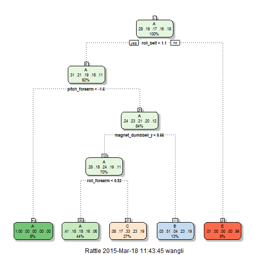

Practical Machine Learning
========================================================
## Synopsis
This project is to predict the manner in which participants performed barbell lifts. The data was collected from accelerometers on the belt, forearm, arm, and dumbell of 6 participants. The "classe" variable in the training set records how participants perform the exercise correctly and incorrectly in 5 different ways.

## Data Processing
First, we download the training and testing datasets.

```r
opts_chunk$set(cache = TRUE)

training <- read.csv(url("http://d396qusza40orc.cloudfront.net/predmachlearn/pml-training.csv"), 
                        na.strings=c("NA","#DIV/0!", ""))
testing <- read.csv(url("http://d396qusza40orc.cloudfront.net/predmachlearn/pml-testing.csv"), na.strings=c("NA","#DIV/0!", ""))
```
By checking the summary of testing and training datasets, we found many variables contain a huge proportion of NA's. So we would like to exclude those variables from our analysis.

```r
library(caret)
train<-training[, -c(nearZeroVar(testing))]
test<-testing[, -c(nearZeroVar(testing))]
dim(train); dim(test)
```

```
## [1] 19622    59
```

```
## [1] 20 59
```
Moreover, the first 6 variables are information about user name and timestamp, which are not relevant to performance of exercise, so we excluded them as well.

```r
train<-train[, -c(1:6)]
test<-test[, -c(1:6)]
dim(train); dim(test)
```

```
## [1] 19622    53
```

```
## [1] 20 53
```
We have 19622 observations in train dataset, but only 20 observations in test dataset. In order to avoid overfitting and test our algorithms with cross-validation, we partition the train dataset into 2 parts: myTrain(75%) and myTest(25%) and test our algorithms on myTest to get the out of sample error.

```r
set.seed(32247)
inTrain <- createDataPartition(y=train$classe, p=0.75, list=FALSE)
myTrain <- train[inTrain, ]; myTest <- train[-inTrain, ]
dim(myTrain); dim(myTest)
```

```
## [1] 14718    53
```

```
## [1] 4904   53
```

## Machine Learning Models
We would like to try two machine learning algorithms for the data: Decision Tree and Random Forests.
Since different variables have different scales, so we would like to standardize them to make them less skewed.

```r
fit1<-train(classe~., preProcess=c("center","scale"),method="rpart",data=myTrain)
```

```
## Loading required namespace: e1071
```

```r
pred1<-predict(fit1, myTest)
confusionMatrix(myTest$classe, pred1)
```

```
## Confusion Matrix and Statistics
## 
##           Reference
## Prediction    A    B    C    D    E
##          A 1271   15  105    0    4
##          B  397  301  251    0    0
##          C  408   26  421    0    0
##          D  399  129  276    0    0
##          E  139  112  231    0  419
## 
## Overall Statistics
##                                           
##                Accuracy : 0.4918          
##                  95% CI : (0.4778, 0.5059)
##     No Information Rate : 0.533           
##     P-Value [Acc > NIR] : 1               
##                                           
##                   Kappa : 0.3348          
##  Mcnemar's Test P-Value : NA              
## 
## Statistics by Class:
## 
##                      Class: A Class: B Class: C Class: D Class: E
## Sensitivity            0.4862  0.51630  0.32788       NA  0.99054
## Specificity            0.9459  0.85003  0.88011   0.8361  0.89243
## Pos Pred Value         0.9111  0.31718  0.49240       NA  0.46504
## Neg Pred Value         0.6173  0.92870  0.78686       NA  0.99900
## Prevalence             0.5330  0.11888  0.26183   0.0000  0.08626
## Detection Rate         0.2592  0.06138  0.08585   0.0000  0.08544
## Detection Prevalence   0.2845  0.19352  0.17435   0.1639  0.18373
## Balanced Accuracy      0.7160  0.68316  0.60400       NA  0.94149
```

```r
library(rattle)
```

```
## Warning: package 'rattle' was built under R version 3.0.3
```

```
## Rattle: A free graphical interface for data mining with R.
## Version 3.4.1 Copyright (c) 2006-2014 Togaware Pty Ltd.
## Type 'rattle()' to shake, rattle, and roll your data.
```

```r
fancyRpartPlot(fit1$finalModel)
```

 
The accuracy is only 49.18%, which is not very good. Next, let's try random forests.

```r
fit2<-train(classe~., preProcess=c("center","scale"),method="rf",data=myTrain)
```

```
## Loading required package: randomForest
```

```
## Warning: package 'randomForest' was built under R version 3.0.3
```

```
## randomForest 4.6-10
## Type rfNews() to see new features/changes/bug fixes.
```

```r
pred2<-predict(fit2, myTest)
confusionMatrix(myTest$classe, pred2)
```

```
## Confusion Matrix and Statistics
## 
##           Reference
## Prediction    A    B    C    D    E
##          A 1394    1    0    0    0
##          B    4  944    1    0    0
##          C    0   10  844    1    0
##          D    0    0   21  783    0
##          E    0    0    3    2  896
## 
## Overall Statistics
##                                           
##                Accuracy : 0.9912          
##                  95% CI : (0.9882, 0.9936)
##     No Information Rate : 0.2851          
##     P-Value [Acc > NIR] : < 2.2e-16       
##                                           
##                   Kappa : 0.9889          
##  Mcnemar's Test P-Value : NA              
## 
## Statistics by Class:
## 
##                      Class: A Class: B Class: C Class: D Class: E
## Sensitivity            0.9971   0.9885   0.9712   0.9962   1.0000
## Specificity            0.9997   0.9987   0.9973   0.9949   0.9988
## Pos Pred Value         0.9993   0.9947   0.9871   0.9739   0.9945
## Neg Pred Value         0.9989   0.9972   0.9938   0.9993   1.0000
## Prevalence             0.2851   0.1947   0.1772   0.1603   0.1827
## Detection Rate         0.2843   0.1925   0.1721   0.1597   0.1827
## Detection Prevalence   0.2845   0.1935   0.1743   0.1639   0.1837
## Balanced Accuracy      0.9984   0.9936   0.9843   0.9955   0.9994
```
The accuracy is 99.12%, so the **expected out of sample error is 0.88%**. So random forest algorithm performed much better than decision tree.

## Prediction Results
Now we use the random forest model to predict the 20 test cases and submit the results.


```r
pred<-predict(fit2, test)
pred
```

```
##  [1] B A B A A E D B A A B C B A E E A B B B
## Levels: A B C D E
```

```r
pml_write_files = function(x){
  n = length(x)
  for(i in 1:n){
    filename = paste0("problem_id_",i,".txt")
    write.table(x[i],file=filename,quote=FALSE,row.names=FALSE,col.names=FALSE)
  }
}
pml_write_files(pred)
```

